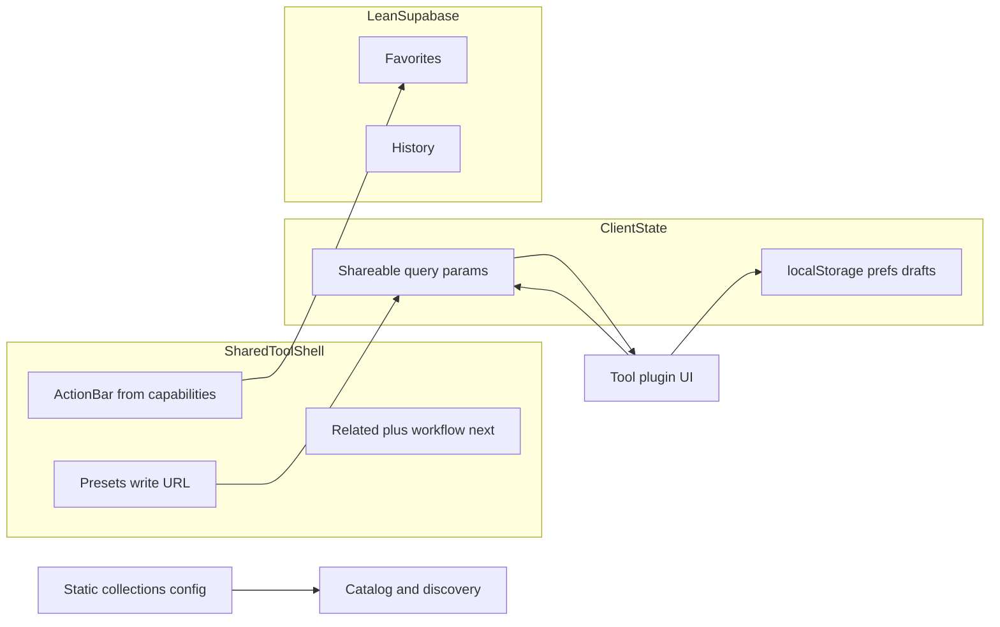

# HeyTools Architecture

**Philosophy:** Build the best **free online tools** platform—not a SaaS.

Priorities: Tool Engine, SEO, performance, maintainability, developer experience, **user experience**.  
Monetize later with ads. Avoid feature bloat.

**Product filter:** If a feature does not help a user complete a task faster or easier, it should not exist.

The platform should feel like **modern software**—fast, minimal, clean, beautiful, intentional. No unnecessary popups. No feature bloat.

## Layers

| Layer      | Path                 | Role                                       |
| ---------- | -------------------- | ------------------------------------------ |
| Routes     | `src/routes`         | Thin HTTP / page composition               |
| Engine     | `src/lib/engine`     | Plugin contracts, registry, search/related |
| Tools      | `src/lib/tools`      | One folder per tool plugin                 |
| SEO        | `src/lib/seo`        | Shared metadata + JSON-LD builders         |
| UI         | `src/lib/ui`         | Design system components                   |
| Features   | `src/lib/features`   | Favorites and history only                 |
| Supabase   | `src/lib/supabase`   | Auth + lean data clients                   |
| Server     | `src/lib/server`     | Env, logging                               |
| Utils      | `src/lib/utils`      | Pure helpers, localStorage prefs           |
| Validation | `src/lib/validation` | Shared Valibot helpers                     |
| Config     | `src/lib/config`     | Site, categories, platform collections     |

## Path aliases

- `$lib` — `src/lib`
- `$engine` — `src/lib/engine`
- `$tools` — `src/lib/tools`
- `$seo` — `src/lib/seo`
- `$ui` — `src/lib/ui`
- `$server` — `src/lib/server`

## Design tokens

Semantic CSS variables live in `src/routes/layout.css` and are exposed to Tailwind v4 via `@theme`.

## Execution model

- Prefer SSR for SEO content (titles, FAQ, related tools).
- Instant tools hydrate minimally and run in the browser.
- File tools prefer browser/WASM; Storage only when necessary.
- Form actions re-validate on the server when used.

## Backend (lean Supabase)

Supabase is used only for:

- Authentication
- Profiles
- Favorites
- Tool history (throttled upsert-style writes)

**v1 note:** Image and PDF file tools run entirely in the browser. The Storage `uploads` table may exist in migrations but is **unused** in v1 application code.

**Not in scope:** subscriptions, billing, API keys, **user-owned** collections, bookmarks, saved sessions, first-party analytics tables.

**Platform collections** (static curated tool packs, no accounts) are in scope—see Platform UX below.

## Analytics

Env-flagged external analytics only — no first-party event DB.

- `PUBLIC_PLAUSIBLE_DOMAIN` → loads Plausible
- `PUBLIC_SA_DOMAIN` → loads Simple Analytics
- Client helper: `$lib/analytics/provider.ts` (`trackEvent`, `resolveAnalyticsConfig`)
- Layout mounts `$lib/analytics/Analytics.svelte` when configured

## Ads readiness

`PUBLIC_ADS_ENABLED=true` shows placeholder `AdSlot` regions (header, footer, in-tool). No ad network is hard-wired; inject creatives later without touching tool plugins.

## Performance targets

Aim for Lighthouse Performance / SEO / Best Practices / Accessibility ≥ 95 on tool pages. Keep shared client JS small; tools stay code-split via dynamic UI imports.

## Out of scope

Deployment/infrastructure. SaaS product features. Public developer API. User-owned collections and bookmarks.

---

## Platform UX capabilities

These are **platform-level** features every tool inherits through the shared shell and `ToolDefinition` contract. They do not replace the plugin engine, routing, SEO, or Supabase—they extend them.



### 1. Shareable tool state

Whenever technically possible, complete tool state is recoverable from the URL query string.

Examples:

- `/tools/json-formatter?input=...`
- `/tools/password-generator?length=32&uppercase=true`
- `/tools/color-converter?hex=ff0000`

Benefits: bookmarkable, shareable, browser history, documentation, tutorials, Stack Overflow, Reddit.

This is a **first-class platform capability**. Tools declare shareable param keys via `share.params` on `ToolDefinition`. Large payloads may use compression or localStorage fallback (documented per tool).

### 2. Smart presets

Some tools expose predefined presets that map to URL parameters—no database.

Examples:

| Tool               | Presets                                            |
| ------------------ | -------------------------------------------------- |
| Password Generator | Developer Password, Strong Password, PIN Generator |
| Color Converter    | HEX → RGB, RGB → HSL                               |
| JSON Formatter     | Pretty Print, Minify, Validate                     |

Presets are declared on `ToolDefinition.presets` and simply update URL parameters when selected.

### 3. Favorites

Users can favorite tools when signed in. This remains one of the few account-based features and improves repeat access to high-value tools.

### 4. History

Signed-in users can reopen recently used tools. History is stored in Supabase (`tool_history`), not localStorage.

### 5. Cross-tool workflows

Tools are not isolated islands. The engine supports logical next/previous steps via `workflow.next` and `workflow.prev` on `ToolDefinition`.

Example chain:

```
JSON Formatter → Validate JSON → Minify JSON → Base64 Encode
```

The shared shell surfaces “Next step” recommendations alongside related tools.

### 6. Related tools

Recommendations combine:

- Manual `metadata.related` links
- Category overlap
- Tag overlap
- Workflow edges (`workflow.next`)
- Keyword/intent similarity (existing scorer in `$engine/registry`)

Scoring evolves in the registry; tools only declare edges and metadata.

### 7. localStorage

Use `localStorage` for lightweight client UX:

- Theme preference
- Last used options per tool
- Draft text (when not shareable via URL)
- Tool-specific preferences

Use the namespaced helper in `$lib/utils/local-prefs.ts` (`heytools:<toolId>:<key>`).

**Do not** store temporary UI state in Supabase.

### 8. Copy / Share action bar

Every tool page uses a consistent action bar rendered by the shared shell. Possible actions:

| Action     | When enabled                                        |
| ---------- | --------------------------------------------------- |
| Copy       | Tool declares `copy` capability and provides output |
| Download   | Tool declares `download` capability                 |
| Reset      | Tool declares `reset` capability                    |
| Share Link | Tool declares `share` capability and `share.params` |
| Favorite   | Tool declares `favorite` capability; user signed in |

The shell enables or disables actions based on `ToolDefinition.capabilities`.

### 9. Tool capabilities

Extend `ToolDefinition` beyond `mode` (`instant | form | upload | hybrid`):

```ts
capabilities?: Array<
  'copy' | 'download' | 'share' | 'upload' | 'clipboard' | 'favorite' | 'history' | 'reset'
>;
presets?: Array<{ id: string; label: string; params: Record<string, string> }>;
workflow?: { next?: ToolId[]; prev?: ToolId[] };
share?: { params: string[]; maxParamBytes?: number };
```

All fields are optional. Existing tools compile unchanged until they opt in.

### 10. Command palette

**Ctrl/⌘ K** opens a global command palette (search tools, categories, packs, and navigation). Mounted in the root layout; Header exposes a Search shortcut button.

### 11. Trending / Recently Added (not in v1)

Reserved for a future release using external analytics pageviews. **Not shipped in v1.0.0.**

### 12. Platform collections

**Platform collections** are static, account-free curated packs defined in `$lib/config/collections.ts` and shown on the homepage (`#pack-{id}` anchors). There is no `/collections/[slug]` route in v1.
